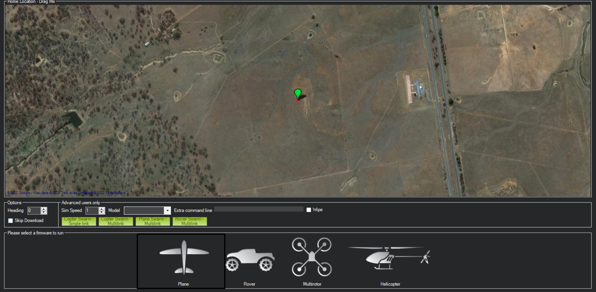

# Getting Started

Planekit helps you create powerful apps for **fixed-wing** UAVs. These apps run on a UAV’s Companion Computer, and augment the autopilot by performing tasks that are both computationally intensive and require a low-latency link.

This documentation provides everything you need to get started with Planekit, including an overview of the API, quick start, guide material, a number of demos and examples, and API Reference.

<!-- Or **try Docusaurus immediately** with **[docusaurus.new](https://docusaurus.new)**. -->

<!-- ### What you'll need

- [Node.js](https://nodejs.org/en/download/) version 14 or above:
  - When installing Node.js, you are recommended to check all checkboxes related to dependencies. -->
<!-- 
## Generate a new site

Generate a new Docusaurus site using the **classic template**.

The classic template will automatically be added to your project after you run the command:

```bash
npm init docusaurus@latest my-website classic
```

You can type this command into Command Prompt, Powershell, Terminal, or any other integrated terminal of your code editor.

The command also installs all necessary dependencies you need to run Docusaurus. -->

## Install Planekit

```
pip install planekit
```

# Start simulation anywhere or connect UAV:

Plankit does not include any built-in simulation. Therefore, you must connect the planekit still or an arduplane installed UAV.

A simple example of starting a still with Mission planar



Planekit supports other alternatives. (Mavproxy etc.)
## First connection

You can see the first connection example below.

```md title="Connection.py"
import planekit

vehicle = planekit.Connection("tcp:127.0.0.1:5762")
vehicle.wait_heartbeat()
print("connection is successful")

```